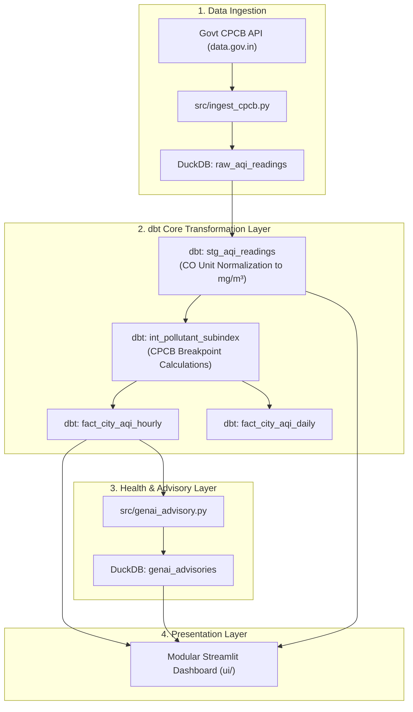

# 🌫️ AirIndex India — Production AQI Pipeline & Dashboard

A production-grade, real-time Air Quality Index (AQI) intelligence system and Streamlit dashboard monitoring Indian cities. Powered by official **Central Pollution Control Board (CPCB)** data from `data.gov.in`, **DuckDB**, **dbt core**, and **Apache Airflow / GitHub Actions**.

---

## 🏗️ Architecture & Data Pipeline Flow



---

## ⚡ Quickstart

### 1. Install Dependencies
```bash
pip install -r requirements.txt
```

### 2. Set Up Environment Variables
Create a `.env` file in the project root:
```env
DATA_GOV_IN_API_KEY=YOUR_API_KEY
```

### 3. Run End-to-End Pipeline & Launch App
```bash
# Run ingestion, station updates, dbt models, dbt tests & advisories
python run_pipeline.py

# Launch Streamlit web dashboard
streamlit run app.py
```

---

## 🎯 Technical Interview Q&A & System Design Defense

When evaluating or discussing this project during technical interviews, the following architectural choices demonstrate real-world data engineering best practices:

### Q1: Why is dbt running out-of-band in Airflow, but available as a Streamlit button?
> **Answer**: In an enterprise web architecture, web apps are decoupled read-only serving layers that read transformed data from analytical databases (DuckDB/Snowflake/BigQuery). Ingestion and dbt transformations run asynchronously out-of-band via Apache Airflow (`dags/aqi_ingestion_dag.py`) on an hourly schedule. The sidebar *"On-Demand Live Refresh"* button is provided strictly as a local demo convenience to trigger live CPCB API fetches and dbt model execution inside interactive reviewer sessions without requiring an Airflow server running locally.

### Q2: How do you handle DuckDB ephemeral storage on free-tier Streamlit Community Cloud?
> **Answer**: Free-tier cloud app servers reset their local filesystem when instances sleep or redeploy. AirIndex uses a two-pronged resilience strategy:
> 1. **Automated GitHub Actions Cron**: `.github/workflows/pipeline.yml` runs hourly, executes `run_pipeline.py`, and automatically commits updated `airindex.duckdb` snapshots back to `main`.
> 2. **Cold Boot Seed Bootstrapping**: `src/seed_loader.py` checks for database initialization on app startup. If tables are empty, it immediately seeds baseline station dimension metadata so national overview maps and historical charts render instantly.

### Q3: Where is pollutant unit conversion handled (e.g. CO values)?
> **Answer**: All unit conversions (such as converting raw CPCB API Carbon Monoxide values from µg/m³ to mg/m³) are strictly handled at the **dbt staging layer** (`dbt_airindex/models/staging/stg_aqi_readings.sql`). The Python rendering layer (`ui/`) does zero unit hacking, consuming clean, pre-normalized data directly from transformed staging/intermediate models.

### Q4: What is the methodology behind the Cigarette Equivalence metric?
> **Answer**: Cigarette equivalence is calculated using the **Berkeley Earth** rule-of-thumb model (*1 cigarette ≈ 22 µg/m³ of PM₂.₅ over 24-hour continuous exposure*). The dashboard explicitly includes interactive methodology popovers explaining that while this serves as an intuitive visual communication metric for public health risk, active cigarette smoking involves distinct combustion carcinogens.

---

## 📁 Repository Modular Structure

```
airindex/
├── .github/workflows/      # Hourly GitHub Actions pipeline execution & DuckDB state persistence
├── app.py                  # Lightweight Streamlit application entrypoint (< 150 lines)
├── config.py               # Shared project configurations & constants
├── dags/                   # Production Apache Airflow DAGs (out-of-band pipeline)
├── dbt_airindex/           # dbt core transformations (Staging, Intermediate, Marts)
│   ├── models/
│   │   ├── staging/        # stg_aqi_readings.sql (CO normalization & deduplication)
│   │   ├── intermediate/   # int_pollutant_subindex.sql (CPCB Breakpoint calculation)
│   │   └── marts/          # fact_city_aqi_hourly.sql & fact_city_aqi_daily.sql
├── run_pipeline.py         # End-to-end Python pipeline runner script
├── src/                    # Ingestion, schema initialization & advisory generation
│   ├── db.py               # DuckDB connection manager & table schema creator
│   ├── genai_advisory.py   # Daily health advisory engine
│   ├── ingest_cpcb.py      # Real CPCB API batch ingestion
│   └── seed_loader.py      # Baseline seed dataset loader for cloud boot resilience
└── ui/                     # Modular presentation package
    ├── components/         # Reusable UI views (header, overview, city detail, architecture drawer)
    ├── data.py             # Cached database query loaders (@st.cache_data)
    ├── icons.py            # Pixel-aligned 24x24 SVG icon helpers
    └── theme.py            # Glassmorphic dark theme CSS definitions
```
