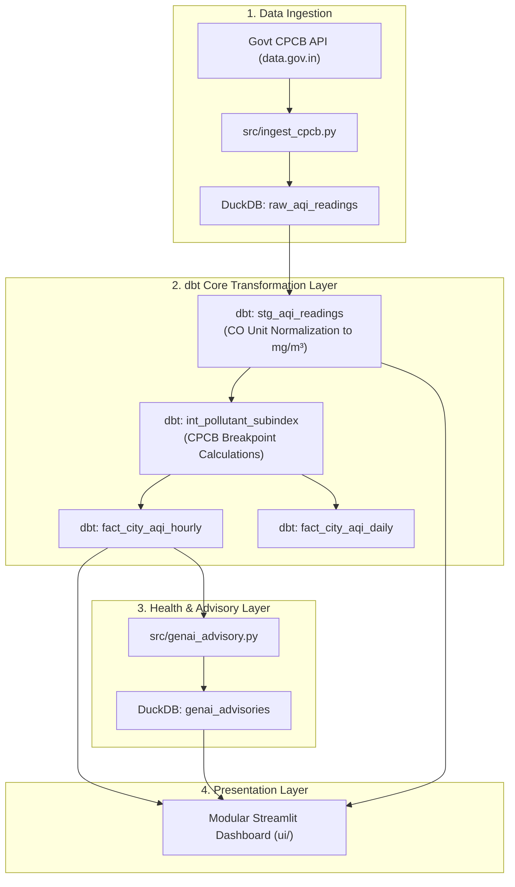

# 🌫️ AirIndex India — Production AQI Pipeline & Dashboard

A production-grade, real-time Air Quality Index (AQI) intelligence system and Streamlit dashboard monitoring Indian cities. Powered by official **Central Pollution Control Board (CPCB)** data from `data.gov.in`, **DuckDB**, **dbt core**, and **Apache Airflow / GitHub Actions**.

---

## 🏗️ Architecture & Data Pipeline Flow



---

## ⚡ Quickstart

### 1. Install Dependencies
```bash
pip install -r requirements.txt
```

### 2. Set Up Environment Variables
Create a `.env` file in the project root:
```env
DATA_GOV_IN_API_KEY=YOUR_API_KEY
```

### 3. Run End-to-End Pipeline & Launch App
```bash
# Run ingestion, station updates, dbt models, dbt tests & advisories
python run_pipeline.py

# Launch Streamlit web dashboard
streamlit run app.py
```

---

## 🎯 Technical Interview Q&A & System Design Defense

When evaluating or discussing this project during technical interviews, the following architectural choices demonstrate real-world data engineering best practices:

### Q1: Why is dbt running out-of-band in Airflow, but available as a Streamlit button?
> **Answer**: In an enterprise web architecture, web apps are decoupled read-only serving layers that read transformed data from analytical databases (DuckDB/Snowflake/BigQuery). Ingestion and dbt transformations run asynchronously out-of-band via Apache Airflow (`dags/aqi_ingestion_dag.py`) on an hourly schedule. The sidebar *"On-Demand Live Refresh"* button is provided strictly as a local demo convenience to trigger live CPCB API fetches and dbt model execution inside interactive reviewer sessions without requiring an Airflow server running locally.

### Q2: How do you handle DuckDB ephemeral storage on free-tier Streamlit Community Cloud?
> **Answer**: Free-tier cloud app servers reset their local filesystem when instances sleep or redeploy. AirIndex uses a two-pronged resilience strategy:
> 1. **Automated GitHub Actions Cron**: `.github/workflows/pipeline.yml` runs hourly, executes `run_pipeline.py`, and automatically commits updated `airindex.duckdb` snapshots back to `main`.
> 2. **Cold Boot Seed Bootstrapping**: `src/seed_loader.py` checks for database initialization on app startup. If tables are empty, it immediately seeds baseline station dimension metadata so national overview maps and historical charts render instantly.

### Q3: Where is pollutant unit conversion handled (e.g. CO values)?
> **Answer**: All unit conversions (such as converting raw CPCB API Carbon Monoxide values from µg/m³ to mg/m³) are strictly handled at the **dbt staging layer** (`dbt_airindex/models/staging/stg_aqi_readings.sql`). The Python rendering layer (`ui/`) does zero unit hacking, consuming clean, pre-normalized data directly from transformed staging/intermediate models.

### Q4: What is the methodology behind the Cigarette Equivalence metric?
> **Answer**: Cigarette equivalence is calculated using the **Berkeley Earth** rule-of-thumb model (*1 cigarette ≈ 22 µg/m³ of PM₂.₅ over 24-hour continuous exposure*). The dashboard explicitly includes interactive methodology popovers explaining that while this serves as an intuitive visual communication metric for public health risk, active cigarette smoking involves distinct combustion carcinogens.

---

## 📖 Official CPCB AQI Breakpoint Matrix & Data Sources

### National Air Quality Index (NAQI) Breakpoints (Government of India)
Concentrations in µg/m³ (CO in mg/m³):

| Category | Index Range | PM₂.₅ (24h) | PM₁₀ (24h) | NO₂ (24h) | SO₂ (24h) | CO (8h) | O₃ (8h) | NH₃ (24h) |
| :--- | :--- | :--- | :--- | :--- | :--- | :--- | :--- | :--- |
| **Good** | 0–50 | 0–30 | 0–50 | 0–40 | 0–40 | 0–1.0 | 0–50 | 0–200 |
| **Satisfactory** | 51–100 | 31–60 | 51–100 | 41–80 | 41–80 | 1.1–2.0 | 51–100 | 201–400 |
| **Moderate** | 101–200 | 61–90 | 101–250 | 81–180 | 81–380 | 2.1–10.0 | 101–168 | 401–800 |
| **Poor** | 201–300 | 91–120 | 251–350 | 181–280 | 381–800 | 10.1–17.0 | 169–208 | 801–1200 |
| **Very Poor** | 301–400 | 121–250 | 351–430 | 281–400 | 801–1600 | 17.1–34.0 | 209–748 | 1201–1800 |
| **Severe** | 401–500 | >250 | >430 | >400 | >1600 | >34.0 | >748 | >1800 |

### Official Data Source References
- **Data Provider**: Central Pollution Control Board (CPCB), Ministry of Environment, Forest and Climate Change, Govt. of India.
- **Open Data Portal**: [data.gov.in — Real-time Air Quality Index API](https://api.data.gov.in/resource/3b01bcb8-0b14-4abf-b6f2-c1bfd384ba69)

---

## 📁 Repository Modular Structure

```
airindex/
├── .github/workflows/
├── app.py
├── config.py
├── dags/
├── dbt_airindex/
│   ├── models/
│   │   ├── staging/
│   │   ├── intermediate/
│   │   └── marts/
├── run_pipeline.py
├── src/
│   ├── db.py
│   ├── genai_advisory.py
│   ├── ingest_cpcb.py
│   └── seed_loader.py
└── ui/
    ├── components/
    ├── data.py
    ├── icons.py
    └── theme.py
```
